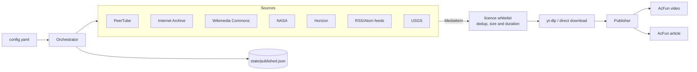

# MediaBridge

Automatically repost openly-licensed video and articles to [AcFun](https://www.acfun.cn), on a schedule, using GitHub Actions. No server required.

MediaBridge discovers freely-licensed material from configurable sources, checks each item against a licence whitelist, downloads it, and submits it to AcFun as a 转载 (repost) with attribution. A dedup ledger committed back to the repository ensures nothing is posted twice.



`MediaItem` is the only type both halves know about: a source never learns which platform consumes its output, and a publisher never learns where an item came from. That is what makes both sides pluggable.

## Quick start

### 1. Fork this repository

### 2. Add your AcFun session as a repository secret

This is the only credential the workflow needs.

Go to **Settings → Secrets and variables → Actions → New repository secret**. It is under the *Security* heading in the left sidebar — **not** *Deploy keys*, which holds SSH keys for Git access and is never read by a workflow.

| Field | Value |
| --- | --- |
| **Name** | `ACFUN_COOKIE` (exactly; the workflow reads `secrets.ACFUN_COOKIE`) |
| **Secret** | your cookie text, see below |

Export the cookies from a browser where you are signed in to AcFun — [docs/COOKIES.md](docs/COOKIES.md) has both methods, and the parser accepts a Set-Cookie dump or Cookie-Editor JSON without being told which. Only two cookies actually matter, so paste just these rather than the whole export:

```
acPasstoken=<value>;Domain=acfun.cn;Path=/;Expires=<date>
auth_key=<value>;Domain=acfun.cn;Path=/;Expires=<date>
```

Keep the `Expires` attribute: it is what `login-check` uses to warn you before the session lapses. Everything else in a typical export is analytics (`Hm_lvt_*`, `Hm_lpvt_*`, `HMACCOUNT`) — MediaBridge discards those anyway, and they encode your browsing history, so there is no reason to put them in a secret store.

> `acPasstoken` is equivalent to full control of the account. GitHub hides a secret once saved, and MediaBridge redacts upload tokens from its logs, but on a public repository the Actions log is public — keep that in mind if you add debug output.

### 3. Create `config.yaml` and commit it

**The workflow reads `config.yaml`, which is deliberately not in the repository** — only `config.example.yaml` is. A scheduled run without it fails immediately with `Config file not found`.

```bash
cp config.example.yaml config.yaml
# edit it, then:
git add config.yaml && git commit -m "Add my MediaBridge config" && git push
```

Every source in the example is disabled except `blender-open-movies`, so review which ones you actually want before pushing.

### 4. Find the partition you want to publish into

```bash
pip install -e .
mediabridge channels             # video partitions -> publish.channel_id
mediabridge channels --articles  # article realms   -> publish.realm_id
```

### 5. Rehearse before going live

```bash
mediabridge login-check          # is the session valid, and for how long?
mediabridge check-config         # does every source and target resolve?
mediabridge run --dry-run        # what would be published?
```

### 6. Enable the workflow

`Actions` → `Publish to AcFun` → `Run workflow`. `dry_run` is checked by default for manual runs, so the first one is safe.

## When it runs

```yaml
schedule:
  - cron: "30 2 * * *"
```

**02:30 UTC every day, which is 10:30 China time.** Cron in GitHub Actions is always UTC and ignores your repository's locale.

The schedule became active the moment the workflow landed on the default branch; there is nothing to switch on. A few things about it are worth knowing:

- **A scheduled run publishes for real.** The `dry_run` default of `true` applies only to manual runs — the `inputs` context does not exist for a `schedule` event, so the flag is absent and the run submits. This is intended, but it means the first scheduled run after you push is live.
- **GitHub's scheduler is best-effort.** Runs are queued, not guaranteed on the minute, and are delayed or dropped entirely under load. `30` rather than `00` avoids the worst of the congestion at the top of the hour. Treat a missed day as normal; the dedup ledger means the next run simply picks up what was missed.
- **Only the default branch is scheduled.** Editing the cron on a feature branch changes nothing until it merges.
- **GitHub disables schedules on repositories that have been inactive for 60 days**, and emails the owner first. This workflow commits the ledger back after each publishing run, which keeps the repository active.

To change the time, edit the cron and remember to convert: China time minus 8 hours. `"0 14 * * *"` would be 22:00 China time.

## Commands

| Command | Purpose |
| --- | --- |
| `mediabridge run` | Discover, download, publish |
| `mediabridge run --dry-run` | Report what would be published; downloads nothing |
| `mediabridge run --dry-run --download` | Also rehearse the download path, still without submitting |
| `mediabridge run --source NAME` | Restrict the run to one configured source |
| `mediabridge refresh` | Re-render items already in the ledger and re-submit them in place; publishes nothing new |
| `mediabridge login-check` | Validate the session and report days until expiry |
| `mediabridge channels` | List video partition IDs |
| `mediabridge channels --articles` | List article realm IDs |
| `mediabridge sources` | List registered source types, including installed plugins |
| `mediabridge check-config` | Validate the config without touching the network |

## Built-in sources

| Type | Licence handling | Notes |
| --- | --- | --- |
| `peertube` | Structured enum, filtered server-side | The most reliable option. Blender's open movies are on `video.blender.org`, itself a PeerTube instance. |
| `archive_org` | Free-text URL, filter mandatory | The majority of items carry no licence metadata at all. Items can also be enormous, so a rendition that fits the disk budget is chosen before downloading. |
| `wikimedia` | Reviewed `extmetadata` | Files are usually `.ogv`/`.webm` and need transcoding to MP4, which is CPU-bound on a runner. |
| `nasa` | Public domain by policy | No API key needed. See the caveat below. |
| `horizon` | You must state it | Articles, not video. See below. |
| `feed` | You must state it | Articles from any RSS/Atom newsroom. See below. |
| `usgs` | Public domain by policy | Articles. Builds an earthquake digest from the USGS event feed. |

Everything is configured in `config.yaml`; see `config.example.yaml` for a commented walkthrough. Any `${VAR}` is substituted from the environment, and a variable that is not set is deliberately left as the literal `${VAR}` so the failure is loud rather than silent.

## Articles (AcFun 专栏)

Set `publish.target: acfun_article` and give it a `realm_id` as well as a `channel_id` (`mediabridge channels --articles`). Three sources feed this path:

- **`feed`** takes any RSS or Atom newsroom. Use `body: content` when the feed carries the whole article, and `body: scrape` with a `body_class` when it carries only a summary and the article lives on the page. `strip_images: true` covers the common case of an outlet that licenses its text but not its photography.
- **`usgs`** has no upstream article at all: it renders the USGS event feed into an earthquake digest. This is the one source whose wording MediaBridge writes itself, so it stays deliberately plain.
- **`horizon`** publishes one AI-scored news digest per day from [Horizon](https://github.com/sayakawaii/Horizon), with `min_score` cutting a 70-item digest down to the handful worth reposting. Its subject matter is AI and research reporting, which is narrower than a general audience wants.

Two things are worth knowing before you enable any of them:

- **`license_name` is mandatory on `feed` and `horizon`, and has no default.** A feed being public says nothing about whether you may repost it. Most newsrooms do not permit it — BBC, 新华社, 人民日报 and 央视 all reserve their rights — and reposting news in China additionally runs into 互联网新闻信息服务 licensing rules that an individual account does not satisfy. Sources with genuinely open terms exist (UN News permits whole stories with credit and a link back; NASA and USGS output is public domain), and MediaBridge will not guess which kind you have found.
- **AcFun silently strips most HTML from article bodies.** Across 38 published articles (~170 kB of stored HTML) only `p`, `strong`, `h1`–`h3`, `br`, `hr`, `img`, `span` and `div` survived, `src` was the only surviving attribute, and **not one `<a>` element appeared anywhere**. `postArticle` reports success either way, so the loss is invisible unless you read the published page. MediaBridge therefore rewrites links as `label (https://example.com)` before submitting — less pretty than a hyperlink, but it is the form that actually reaches the reader, which matters when the links are the attribution. Emoji are stripped too, so they are removed up front rather than left as stray spaces and orphaned variation selectors.

Two limits are enforced client-side, and one of them differs from the video channel:

| | Video | Article |
| --- | --- | --- |
| Description | **200** (`result=109015` above that) | **200** (`result=110014` above that) |
| Cover | required | optional (only title, channel and creationType are mandatory) |

An article has no `originalLinkUrl` field, but its body is unbounded, so **attribution for an article lives in the body**: MediaBridge appends a 转载信息 block naming the author, the source link, the licence and the licence terms to every article it posts. That is not configurable — none of the article sources produce one themselves, and with the description now too small to carry a URL, an omitted block would be the difference between a credited repost and an uncredited copy. Keeping the link in the description as well used to cost 136 characters on a single `science.nasa.gov` URL, leaving 24 of the 200 for the summary; the description now carries only the 转载 marker and the author.

When a rendered description still overflows, MediaBridge shrinks the upstream summary and keeps the credit rather than truncating the end. If the attribution alone will not fit, that is a broken `desc_template` and the submission fails with an error saying so, rather than quietly posting a repost with no credit on it.

If you change a template — or discover another AcFun quirk — `mediabridge refresh` re-renders what is already in the ledger and puts it back through `updateArticle` rather than posting a duplicate. It keeps the original publish date, and if the cover cannot be re-fetched it reuses the one already on the article instead of blanking it. Video has no equivalent endpoint, so the video publisher refuses the operation rather than posting again.

**Reposts are moderated, and moderation can reject the submission outright.** A digest whose geopolitics section covered an FSB terrorism accusation came back as `result=11 网络错误，请稍后再试` after a six-second pause; the same digest limited to `categories: [tech, papers]` was accepted in under a second. If you see `result=11`, suspect the content before the code.

## Licensing: what this tool will and will not do

MediaBridge reposts works **verbatim**. That constrains which licences are safe, and the defaults reflect that:

- **Allowed by default:** CC0, Public Domain Mark, US-Gov public domain, CC BY, CC BY-SA, CC BY-ND. A verbatim repost creates no derivative work, so NoDerivatives is fine.
- **Excluded by default:** NonCommercial variants. AcFun runs monetisation programmes (香蕉 rewards, creator incentives), which makes NC reposting arguable at best. Opt in per source with `license_allow: [non-commercial]` only if you have decided that question for yourself.
- **Never allowed:** anything MediaBridge cannot positively identify. An unrecognised or absent licence is treated as "not permitted", never as "probably fine".

Some sources that look suitable are not:

- **Pexels and Pixabay** explicitly prohibit redistributing their content "standalone" — that is, without meaningful creative modification. Reposting a video as-is is exactly what their terms forbid, and adding a watermark or changing the resolution does not count as creative work. They are not supported.
- **Kurzgesagt and most YouTube channels** publish under the Standard YouTube Licence, not CC BY, whatever a video's description implies.
- **NASA material** is generally not subject to copyright in the US, but the NASA insignia and logotype are protected, and NASA pages occasionally embed third-party copyrighted material. Spot-check what you publish, and do not imply NASA endorsement.

**Publishing to AcFun does not make you the rights holder.** You are responsible for what you post from your account. Reposted submissions also go through human review at AcFun, so a successful upload is not the same as a published video.

### YouTube

There is no YouTube source, and adding one is not recommended.

yt-dlp's maintainers have stated plainly that downloads from data-centre IP ranges — which is all GitHub-hosted runners — are blocked by YouTube, and that there is nothing they can do about it. The usual workaround, supplying browser cookies, means putting a real account's session into CI, where it is subject to both the same bot detection and a genuine risk of the account being banned. Combined with the licensing problem above, the expected value is poor.

If you still want it, YouTube is reachable through the plugin mechanism without modifying this repository. See [docs/EXTENDING.md](docs/EXTENDING.md).

## Operational notes

- **Disk.** GitHub-hosted runners guarantee only about 14 GB free. `limits.max_filesize_mb` defaults to 2000, and each item's working directory is deleted as soon as it has been published.
- **Rate.** `max_items_per_run` defaults to 2. Publishing a burst of reposts is a good way to attract the wrong kind of attention to your account.
- **Budget per channel.** Sources are visited in config-file order and nothing rotates, so a single global budget is spent by whichever sources are listed first. Once you mix video and article sources, set `limits.max_items_per_target` (keyed by `publish.target`, so `acfun_video` and `acfun_article`) or the kind listed second will never publish. `max_items_per_run` still caps the total, so raise it to at least the sum of the per-target caps — the run stops as soon as it is reached, and the shortfall comes out of whichever target is listed last. A source whose target is already spent is skipped before discovery, so it costs no upstream requests.
- **State.** `state/published.json` is committed back to the repository after each run. `actions/cache` would be the obvious alternative, but it is evicted after seven days without a hit, which silently turns into republishing everything.
- **Cookie lifetime.** AcFun sessions last roughly a month. `login-check` runs first in the workflow and fails in seconds if the session has lapsed, rather than after downloading gigabytes that could never be uploaded. A warning appears in the log when fewer than seven days remain.
- **Transcoding is not part of submission.** `createDouga` hands back an id for a video AcFun cannot decode just as readily as for one it can, so the submission is polled for four minutes afterwards. A video still showing `转码失败` at the end of that is *not* written to the ledger: it would otherwise sit permanently broken on the account with its dedup key spent, and nothing would ever retry it. Delete the dead submission by hand — the id is in the run summary. A poll that simply could not be read is treated as success, because re-uploading a video that was probably fine is the more expensive mistake.
- **Repeated failures.** Failures do not count against `max_items_per_source`, so a source that is broken in a systematic way would otherwise be handed candidate after candidate for the whole run. Three consecutive failures abandon that source until the next run.

## Development

```bash
pip install -e ".[dev]"
pytest
ruff check mediabridge tests
```

The test suite runs entirely against recorded response shapes. No test depends on a third party being reachable, which matters because several sources are unreachable from some networks.

## Licence

MIT. See [LICENSE](LICENSE).

This is an independent implementation built from observed API behaviour; no code is derived from other AcFun uploader projects.
