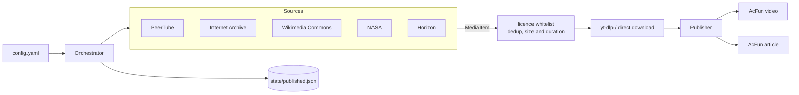

# MediaBridge

Automatically repost openly-licensed video and articles to [AcFun](https://www.acfun.cn), on a schedule, using GitHub Actions. No server required.

MediaBridge discovers freely-licensed material from configurable sources, checks each item against a licence whitelist, downloads it, and submits it to AcFun as a 转载 (repost) with attribution. A dedup ledger committed back to the repository ensures nothing is posted twice.



`MediaItem` is the only type both halves know about: a source never learns which platform consumes its output, and a publisher never learns where an item came from. That is what makes both sides pluggable.

## Quick start

1. **Fork this repository.**

2. **Export your AcFun cookies** and save them as a repository secret named `ACFUN_COOKIE`. See [docs/COOKIES.md](docs/COOKIES.md) — it takes about a minute and both common export formats are accepted.

3. **Write a config.** Copy the example and edit it:

```bash
cp config.example.yaml config.yaml
```

4. **Find the partition ID** you want to publish into:

```bash
pip install -e .
mediabridge channels
```

5. **Rehearse before going live:**

```bash
mediabridge login-check          # is the session valid, and for how long?
mediabridge run --dry-run        # what would be published?
```

6. **Enable the workflow.** `Actions` → `Publish to AcFun` → `Run workflow`. Leave `dry_run` checked for the first manual run; the scheduled run at 02:30 UTC publishes for real.

## Commands

| Command | Purpose |
| --- | --- |
| `mediabridge run` | Discover, download, publish |
| `mediabridge run --dry-run` | Report what would be published; downloads nothing |
| `mediabridge run --dry-run --download` | Also rehearse the download path, still without submitting |
| `mediabridge run --source NAME` | Restrict the run to one configured source |
| `mediabridge refresh` | Re-render items already in the ledger and re-submit them in place; publishes nothing new |
| `mediabridge login-check` | Validate the session and report days until expiry |
| `mediabridge channels` | List video partition IDs |
| `mediabridge channels --articles` | List article realm IDs |
| `mediabridge sources` | List registered source types, including installed plugins |
| `mediabridge check-config` | Validate the config without touching the network |

## Built-in sources

| Type | Licence handling | Notes |
| --- | --- | --- |
| `peertube` | Structured enum, filtered server-side | The most reliable option. Blender's open movies are on `video.blender.org`, itself a PeerTube instance. |
| `archive_org` | Free-text URL, filter mandatory | The majority of items carry no licence metadata at all. Items can also be enormous, so a rendition that fits the disk budget is chosen before downloading. |
| `wikimedia` | Reviewed `extmetadata` | Files are usually `.ogv`/`.webm` and need transcoding to MP4, which is CPU-bound on a runner. |
| `nasa` | Public domain by policy | No API key needed. See the caveat below. |
| `horizon` | You must state it | Articles, not video. See below. |

Everything is configured in `config.yaml`; see `config.example.yaml` for a commented walkthrough. Any `${VAR}` is substituted from the environment, and a variable that is not set is deliberately left as the literal `${VAR}` so the failure is loud rather than silent.

## Articles (AcFun 专栏)

Set `publish.target: acfun_article` and give it a `realm_id` as well as a `channel_id` (`mediabridge channels --articles`). The `horizon` source feeds this path: [Horizon](https://github.com/sayakawaii/Horizon) publishes one AI-scored news digest per day, and `min_score` cuts a 70-item digest down to the handful worth reposting.

Two things are worth knowing before you enable it:

- **`license_name` is mandatory and has no default.** A Horizon digest summarises third-party reporting, so whether you may repost it is a judgement MediaBridge will not make for you. The source refuses to run until you have made it.
- **AcFun silently strips most HTML from article bodies.** Across 38 published articles (~170 kB of stored HTML) only `p`, `strong`, `h1`–`h3`, `br`, `hr`, `img`, `span` and `div` survived, `src` was the only surviving attribute, and **not one `<a>` element appeared anywhere**. `postArticle` reports success either way, so the loss is invisible unless you read the published page. MediaBridge therefore rewrites links as `label (https://example.com)` before submitting — less pretty than a hyperlink, but it is the form that actually reaches the reader, which matters when the links are the attribution. Emoji are stripped too, so they are removed up front rather than left as stray spaces and orphaned variation selectors.

Two limits differ from the video channel and are enforced client-side:

| | Video | Article |
| --- | --- | --- |
| Description | 1000 characters | **200** (`result=110014` above that) |
| Cover | required | optional (only title, channel and creationType are mandatory) |

Because an article has no `originalLinkUrl` field, the description is the only place attribution can live. When the rendered description overflows, MediaBridge shrinks the upstream summary and keeps the credit rather than truncating the end.

If you change a template — or discover another AcFun quirk — `mediabridge refresh` re-renders what is already in the ledger and puts it back through `updateArticle` rather than posting a duplicate. It keeps the original publish date, and if the cover cannot be re-fetched it reuses the one already on the article instead of blanking it. Video has no equivalent endpoint, so the video publisher refuses the operation rather than posting again.

**Reposts are moderated, and moderation can reject the submission outright.** A digest whose geopolitics section covered an FSB terrorism accusation came back as `result=11 网络错误，请稍后再试` after a six-second pause; the same digest limited to `categories: [tech, papers]` was accepted in under a second. If you see `result=11`, suspect the content before the code.

## Licensing: what this tool will and will not do

MediaBridge reposts works **verbatim**. That constrains which licences are safe, and the defaults reflect that:

- **Allowed by default:** CC0, Public Domain Mark, US-Gov public domain, CC BY, CC BY-SA, CC BY-ND. A verbatim repost creates no derivative work, so NoDerivatives is fine.
- **Excluded by default:** NonCommercial variants. AcFun runs monetisation programmes (香蕉 rewards, creator incentives), which makes NC reposting arguable at best. Opt in per source with `license_allow: [non-commercial]` only if you have decided that question for yourself.
- **Never allowed:** anything MediaBridge cannot positively identify. An unrecognised or absent licence is treated as "not permitted", never as "probably fine".

Some sources that look suitable are not:

- **Pexels and Pixabay** explicitly prohibit redistributing their content "standalone" — that is, without meaningful creative modification. Reposting a video as-is is exactly what their terms forbid, and adding a watermark or changing the resolution does not count as creative work. They are not supported.
- **Kurzgesagt and most YouTube channels** publish under the Standard YouTube Licence, not CC BY, whatever a video's description implies.
- **NASA material** is generally not subject to copyright in the US, but the NASA insignia and logotype are protected, and NASA pages occasionally embed third-party copyrighted material. Spot-check what you publish, and do not imply NASA endorsement.

**Publishing to AcFun does not make you the rights holder.** You are responsible for what you post from your account. Reposted submissions also go through human review at AcFun, so a successful upload is not the same as a published video.

### YouTube

There is no YouTube source, and adding one is not recommended.

yt-dlp's maintainers have stated plainly that downloads from data-centre IP ranges — which is all GitHub-hosted runners — are blocked by YouTube, and that there is nothing they can do about it. The usual workaround, supplying browser cookies, means putting a real account's session into CI, where it is subject to both the same bot detection and a genuine risk of the account being banned. Combined with the licensing problem above, the expected value is poor.

If you still want it, YouTube is reachable through the plugin mechanism without modifying this repository. See [docs/EXTENDING.md](docs/EXTENDING.md).

## Operational notes

- **Disk.** GitHub-hosted runners guarantee only about 14 GB free. `limits.max_filesize_mb` defaults to 2000, and each item's working directory is deleted as soon as it has been published.
- **Rate.** `max_items_per_run` defaults to 2. Publishing a burst of reposts is a good way to attract the wrong kind of attention to your account.
- **State.** `state/published.json` is committed back to the repository after each run. `actions/cache` would be the obvious alternative, but it is evicted after seven days without a hit, which silently turns into republishing everything.
- **Cookie lifetime.** AcFun sessions last roughly a month. `login-check` runs first in the workflow and fails in seconds if the session has lapsed, rather than after downloading gigabytes that could never be uploaded. A warning appears in the log when fewer than seven days remain.

## Development

```bash
pip install -e ".[dev]"
pytest
ruff check mediabridge tests
```

The test suite runs entirely against recorded response shapes. No test depends on a third party being reachable, which matters because several sources are unreachable from some networks.

## Licence

MIT. See [LICENSE](LICENSE).

This is an independent implementation built from observed API behaviour; no code is derived from other AcFun uploader projects.
